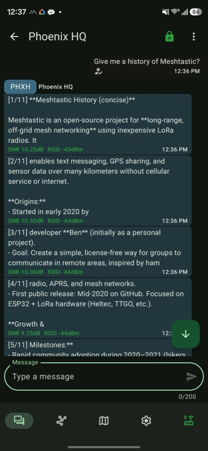

# Adaptador Hermes Meshtastic

`hermes-meshtastic-adapter` es un complemento de la plataforma Hermes Agent que conecta Hermes a una malla LoRa Meshtastic. Recibe mensajes de texto sin formato de los nodos de la malla, los reenvía a las sesiones de Hermes y envía las respuestas de vuelta por LoRa como mensajes directos o transmisiones de canal.

<p align="center">
  
  <br>
  <em>Hablando con el agente Hermes por LoRa desde la aplicación Meshtastic: las respuestas largas se dividen en fragmentos numerados, cada uno etiquetado con calidad de señal en vivo.</em>
</p>

Nomenclatura pública:

- Repositorio de GitHub: `hermes-meshtastic-adapter`
- Nombre del complemento de Hermes: `meshtastic-platform`
- Nombre de la plataforma de Hermes: `meshtastic`

## Qué hace

- Conecta mensajes de texto de Meshtastic con Hermes Agent.
- Crea sesiones separadas de Hermes para mensajes directos de nodos individuales, como `meshtastic:!da1b1613`.
- Crea sesiones compartidas de Hermes para transmisiones de canal, como `meshtastic:channel:0` o `meshtastic:channel:Primary`.
- Envía las respuestas de Hermes de vuelta al nodo o canal de origen.
- Divide las respuestas largas en fragmentos numerados seguros para LoRa.
- Expone herramientas de malla para listar nodos, verificar información del nodo, leer calidad de señal, enviar mensajes de malla y consultar telemetría.
- Almacena telemetría, posición e historial de señal en SQLite.

## Hardware compatible

El adaptador se conecta a un nodo de puerta de enlace a través de USB serial o TCP/IP.

- Se admiten tarjetas ESP32 USB-serial como Heltec WiFi LoRa 32 V3 y son el hardware de puerta de enlace recomendado.
- El nodo de puerta de enlace debe estar alimentado por la pared o USB y configurado como un nodo base/cliente estable.
- Los dispositivos de seguimiento SenseCAP T1000-E y similares nRF52 priorizan BLE; su puerto USB es principalmente para flashear y registros seriales, no para control fiable. No son compatibles con este complemento a través de USB serial.
- El soporte para BLE no está incluido en la v1.

Configuraciones recomendadas para el nodo de puerta de enlace:

- Rol: `CLIENT` o `CLIENT_BASE`.
- Alimentación: USB o alimentación por red eléctrica.
- Desactiva el sueño profundo y el ahorro de energía agresivo en el nodo conectado a la puerta de enlace.
- Bluetooth se puede desactivar después de la configuración inicial de la aplicación Meshtastic.
- La región y la configuración del módem deben coincidir con tu malla.
- `LongFast` o la configuración que elijas debe configurarse de manera consistente en todos los nodos.

## Instalación

Clona o descarga el complemento y luego cópialo en el directorio de complementos de Hermes:

```bash
git clone https://github.com/amscotti/hermes-meshtastic-adapter
mkdir -p ~/.hermes/plugins/meshtastic
cp -R hermes-meshtastic-adapter/* ~/.hermes/plugins/meshtastic/
```

Instala las dependencias en el entorno virtual de Hermes:

```bash
~/.hermes/hermes-agent/venv/bin/python -m pip install -r ~/.hermes/plugins/meshtastic/requirements.txt
```

Habilita el complemento:

```bash
hermes plugins enable meshtastic-platform
```

Reinicia la puerta de enlace de Hermes después de cambiar archivos de complemento o variables de entorno.

## Configuración

Copia la plantilla incluida y edítala para tu nodo y malla:

```bash
cp .env.example .env
```

Ejemplo mínimo de `.env`:

```env
MESHTASTIC_SERIAL_PORT=/dev/cu.usbserial-0001
MESHTASTIC_ALLOWED_NODES=!da1b1613
MESHTASTIC_HOME_CHANNEL=meshtastic:!da1b1613
MESHTASTIC_CHUNK_BYTES=170
MESHTASTIC_CHUNK_DELAY=4.0
MESHTASTIC_ACK_TIMEOUT=0
```

Variables de entorno:

| Variable | Requerida | Predeterminado | Descripción |
| --- | --- | --- | --- |
| `MESHTASTIC_SERIAL_PORT` | No* | `auto` | Ruta serial como `/dev/cu.usbserial-0001`, o `auto` para descubrimiento. *Configura esta o `MESHTASTIC_TCP_HOST`. |
| `MESHTASTIC_BAUD_RATE` | No | `115200` | Solo informativo: la biblioteca meshtastic siempre abre la serial a 115200. |
| `MESHTASTIC_TCP_HOST` | No | Ninguno | Nombre de host o IP de un nodo WiFi/Ethernet. Al establecerse, el adaptador se conecta por TCP en lugar de serial. |
| `MESHTASTIC_TCP_PORT` | No | `4403` | Puerto de API TCP del nodo Meshtastic. |
| `MESHTASTIC_ALLOWED_NODES` | No | Vacío | Lista preferida de permitidos. IDs de nodos separados por comas que pueden comunicarse con Hermes. |
| `MESHTASTIC_ALLOWED_USERS` | No | Vacío | Alias obsoleto para `MESHTASTIC_ALLOWED_NODES`. |
| `MESHTASTIC_ALLOW_ALL_USERS` | No | `false` | Si es true, cualquier nodo de la malla puede comunicarse con Hermes. Úsalo con precaución. |
| `MESHTASTIC_ALLOW_CHANNELS` | No | `false` | Si es true, el agente también responde a mensajes de **canal/transmisión** (respondiendo en el canal compartido). Desactivado por defecto para que el agente solo responda a mensajes directos y no sature el tiempo de aire de un canal público. |
| `MESHTASTIC_HOME_CHANNEL` | No | Vacío | Destino predeterminado/cron, como `meshtastic:!da1b1613` o `meshtastic:channel:0`. Un ID de nodo sin prefijo (`!da1b1613` o `da1b1613`) / valor `channel:N` se antepone automáticamente con `meshtastic:` y una advertencia. |
| `MESHTASTIC_CHUNK_BYTES` | No | `170` | Máx. bytes UTF-8 por fragmento saliente LoRa. `170` es conservador para fiabilidad multi-salto y deja margen para sobrecarga de DM cifrado (PKI); el límite máximo de carga útil del protocolo (y el tope para este valor) es `233`. |
| `MESHTASTIC_CHUNK_DELAY` | No | `4.0` | Retraso en segundos entre envíos de fragmentos. |
| `MESHTASTIC_ACK_TIMEOUT` | No | `0` | Segundos para esperar ACK/NACK por fragmento saliente. `0` es sin bloqueo. Establece `30` para fallar envíos ante NAK o timeout. |
| `MESHTASTIC_SEND_RETRIES` | No | `0` | Intentos de entrega adicionales para fragmentos de **mensaje directo** no ACK. `> 0` implica esperar el ACK; los fallos transitorios (timeout, no-route) se reenvían, los permanentes (p. ej. `TOO_LARGE`) no. Las transmisiones nunca se reintentan. |
| `MESHTASTIC_RETRY_BACKOFF` | No | `5.0` | Segundos a esperar entre reintentos de entrega. |
| `MESHTASTIC_TELEMETRY_RETENTION_DAYS` | No | `30` | Edad (días) en que las filas de telemetría/posición/señal persistedas se purgan de SQLite. `0` desactiva la purga. La purga se ejecuta como máximo cada hora, de forma diferida en escrituras. |
| `MESHTASTIC_MOCK` | No | `false` | `true` ejecuta el adaptador contra la interfaz simulada (ejecución en seco, sin tráfico real de radio). Solo relevante cuando falta la biblioteca meshtastic; de lo contrario, el adaptador siempre abre la interfaz serial/TCP real. |
| `MESHTASTIC_AUTOINSTALL` | No | `true` | Cuando falta la biblioteca meshtastic, el adaptador ejecuta `pip install -r requirements.txt` en el entorno Python de la puerta de enlace una vez por proceso (las actualizaciones de Hermes pueden borrar dependencias de complementos). Establece `0`/`false` para desactivarlo y fallar con instrucciones de instalación en su lugar. |

## Conexión por IP (TCP)

Los nodos con capacidad WiFi o Ethernet exponen una API TCP (puerto predeterminado `4403`). Establece `MESHTASTIC_TCP_HOST` para conectarte a través de la red en lugar de USB serial:

```env
MESHTASTIC_TCP_HOST=192.168.1.50
MESHTASTIC_TCP_PORT=4403
```

Cuando se establece `MESHTASTIC_TCP_HOST` tiene prioridad y se omite el descubrimiento serial: el adaptador usa un solo transporte a la vez. Habilita WiFi/Ethernet y la API de red en el nodo a través de la aplicación Meshtastic primero. La reconexión con backoff exponencial y la cola de salida funcionan igual que por serial.

## IDs de Chat

Los mensajes directos usan IDs de chat con alcance de nodo:

```text
meshtastic:!da1b1613
```

Los mensajes de canal usan IDs de chat con alcance de grupo:

```text
meshtastic:channel:0
meshtastic:channel:Primary
```

## Herramientas

El complemento registra estas herramientas de Hermes:

- `mesh_list_nodes`: lista nodos visibles y estado de señal.
- `mesh_node_info`: inspecciona un nodo por ID o nombre.
- `mesh_signal_quality`: verifica SNR/RSSI actuales y recientes.
- `mesh_send_dm`: envía un mensaje directo a un nodo.
- `mesh_send_broadcast`: envía una transmisión de canal.
- `mesh_telemetry`: lee telemetría reciente de un nodo.
- `mesh_telemetry_history`: consulta telemetría, posición o historial de señal persistedo.

### Frescura del Nodo

La biblioteca meshtastic solo actualiza `lastHeard` de un nodo a partir de paquetes periódicos **NodeInfo**, por lo que se retrasa respecto a las transmisiones reales del nodo. El adaptador, por tanto, rastrea una superposición en vivo desde el flujo de paquetes: en cada paquete recibido actualiza el `last_heard` del emisor (desde el `rxTime` del paquete) y, para paquetes directos (0 saltos), su `snr`/`rssi` — reflejando al cliente oficial de Meshtastic. Esto se hace para **cada** nodo escuchado (incluidos los que no están en la lista de permitidos, para que puedas vigilar un nodo que no puentees), y `mesh_list_nodes` / `mesh_node_info` / `mesh_signal_quality` reportan el valor más reciente entre el de la biblioteca y esta superposición. `mesh_node_info` también devuelve `last_heard` / `last_heard_epoch`.

## Semántica de Entrega

La entrega de Meshtastic y LoRa es de mejor esfuerzo.

- El adaptador solicita ACKs con `wantAck=True` para paquetes salientes.
- El adaptador registra una devolución de llamada `onAckNak` y registra ACK/NACK por ID de paquete cuando Meshtastic los proporciona.
- El adaptador distingue un ACK **real** de extremo a extremo (enviado por el destino mismo) de un ACK **implícito** retransmitido por otro nodo (el paquete alcanzó la malla pero el destino no confirmó recepción) — reflejando RECEIVED vs DELIVERED del cliente oficial. Solo un ACK real cuenta como entregado; un ACK solo implícito se trata como no confirmado (y, con reintentos activados, se reenvía).
- Por defecto, los envíos son sin bloqueo: que `sendText()` devuelva éxito significa que la radio local aceptó el paquete, y las devoluciones de llamada ACK/NACK posteriores se registran si llegan.
- Establece `MESHTASTIC_ACK_TIMEOUT=30` o pasa metadatos de envío `meshtastic_ack_timeout` para esperar ACK/NACK por fragmento. En este modo, los NAK y timeouts hacen que `SendResult.success` sea falso.
- Los resultados ACK se exponen en `SendResult.raw_response["chunks"][i]["ack"]` para envíos esperados, y pueden inspeccionarse luego en código con `adapter.get_ack_status(packet_id)`.
- Establece `MESHTASTIC_SEND_RETRIES=3` para reenviar automáticamente fragmentos de **mensaje directo** no ACK. Un reintento solo se activa ante un fallo transitorio (timeout ACK, no-route, max-retransmit); los NAK permanentes (`TOO_LARGE`, `NO_CHANNEL`, errores de auth/PKI) no se reintentan, y las transmisiones nunca se reintentan (sin ACK por destinatario). Cada reintento espera `MESHTASTIC_RETRY_BACKOFF` segundos; el conteo de intentos por fragmento se expone en `SendResult.raw_response["chunks"][i]["attempts"]`. Nota: si un mensaje se entregó realmente pero su ACK se perdió, un reintento envía un duplicado.
- Las respuestas largas se dividen y ritman, pero cualquier fragmento aún puede ser descartado por la malla.

Incluso con la espera de ACK activada, la entrega sigue siendo de mejor esfuerzo porque el comportamiento de ACK depende de la calidad de la ruta, el comportamiento del firmware del nodo y si el destino está despierto.

## Entrega Cron

Establece `MESHTASTIC_HOME_CHANNEL` para permitir que los trabajos cron de Hermes entreguen salida a través de Meshtastic.

Ejemplos:

```env
MESHTASTIC_HOME_CHANNEL=meshtastic:!da1b1613
MESHTASTIC_HOME_CHANNEL=meshtastic:channel:0
```

El emisor cron independiente crea una conexión de adaptador de corta vida cuando es necesario y desactiva la cola para que los fallos cron sean visibles. Una mejora futura debería preferir reutilizar el adaptador de puerta de enlace ya conectado cuando esté disponible.

## Energía y Suspensión

El complemento no modifica la configuración de energía de Meshtastic ni fuerza a los nodos remotos a permanecer despiertos.

Lo que hace:

- Mantiene una conexión USB serial abierta con el nodo de puerta de enlace.
- Ejecuta comprobaciones de reconexión.
- Drena mensajes salientes en cola después de reconectar.

Lo que no hace:

- Desactivar el sueño ligero o profundo.
- Cambiar la configuración de energía de Meshtastic.
- Enviar paquetes de keepalive de radio.
- Evitar que los nodos alimentados por batería entren en suspensión.

Para una puerta de enlace/estación base, configura el comportamiento de energía en el nodo mismo a través de los ajustes de Meshtastic.

## Notas de Seguridad

- No habilites `MESHTASTIC_ALLOW_ALL_USERS=true` a menos que entiendas el riesgo.
- Prefiere listas de permitidos por nodo y mensajes directos.
- El envío de transmisiones puede consumir rápidamente el tiempo de aire compartido de la malla.
- Las respuestas largas de IA pueden ser poco educadas en mallas públicas o congestionadas.
- Los mensajes de malla pueden ser interceptados dependiendo de la configuración del canal y el intercambio de claves.
- No expongas claves de canal o claves privadas a los prompts, registros o herramientas de Hermes.

## Solución de Problemas

### El complemento usa una conexión serial simulada (mock)

La interfaz simulada solo se usa cuando optas explícitamente por ella o cuando el auto-descubrimiento serial no encuentra nada:

- **Biblioteca Meshtastic faltante** — el adaptador ahora falla de forma explícita en lugar de fingir silenciosamente que funciona. El registro de la puerta de enlace muestra un `RuntimeError` con el comando de instalación, y el adaptador intenta **una instalación automática** `pip install -r requirements.txt` en el intérprete en ejecución (`MESHTASTIC_AUTOINSTALL=0` la desactiva). Las actualizaciones automáticas de Hermes reconstruyen el venv de ejecución y pueden eliminar las dependencias del complemento; después de una actualización, verifica el registro de la puerta de enlace para este error o las líneas de `mock_interface`.
- **`MESHTASTIC_MOCK=1`** — ejecuta explícitamente contra la interfaz simulada (ejecución en seco; sin tráfico real de radio) incluso cuando falta la biblioteca.
- **No se encuentra puerto serial con `auto`** — se registra una advertencia y el adaptador cae en `mock_port`. Establece `MESHTASTIC_SERIAL_PORT` explícitamente en lugar de `auto`.

Instalación manual en el venv de Hermes:

```bash
~/.hermes/hermes-agent/venv/bin/python -m pip install -r ~/.hermes/plugins/meshtastic/requirements.txt
```

### Puerto serial no encontrado

- Los puertos de macOS suelen parecerse a `/dev/cu.usbserial-*` o `/dev/cu.usbmodem*`.
- Los puertos de Linux suelen parecerse a `/dev/ttyUSB*` o `/dev/ttyACM*`.
- Instala controladores CP210X o CH34X si tu tarjeta los requiere.
- Asegúrate de que ningún otro cliente Meshtastic esté reteniendo el puerto serial.

### Los mensajes directos fallan silenciosamente

El nodo destino puede no haber inicializado los metadatos de clave pública. Empareja el nodo con la aplicación móvil oficial de Meshtastic al menos una vez, y luego permite que la información del nodo se propague por la malla.

### Las respuestas largas tienen fragmentos faltantes

- Establece `MESHTASTIC_CHUNK_BYTES=170`.
- Aumenta `MESHTASTIC_CHUNK_DELAY` a `5.0` o superior.
- Prefiere prompts y respuestas más cortas en mallas débiles o de múltiples saltos.

### Nodos con batería no reciben mensajes

Los nodos en suspensión o ahorro de energía pueden no recibir mensajes inmediatamente. Configura el comportamiento de energía del dispositivo en Meshtastic.

## Desarrollo

Las herramientas de desarrollo están en el `.venv` del repositorio (gestionado por uv); usa `.venv/bin/python` para los comandos a continuación. El venv de Hermes en `~/.hermes/hermes-agent/venv` **no** incluye ruff/pyrefly/coverage.

```bash
uv sync   # o: uv venv && uv pip install -r requirements.txt -r requirements-dev.txt
```

Ejecuta el conjunto completo de pruebas (cinco módulos de prueba, serial simulado + SQLite temporal):

```bash
.venv/bin/python -m unittest \
  test_meshtastic.py test_chunking.py test_node_freshness.py \
  test_transport.py test_ack_state.py
```

Ejecuta formateo, linting y comprobaciones de tipos:

```bash
.venv/bin/python -m ruff format .
.venv/bin/python -m ruff check .
.venv/bin/python -m pyrefly check \
  --python-interpreter-path .venv/bin/python \
  --search-path ~/.hermes/hermes-agent --min-severity warn
```

Las solicitudes de extracción se verifican con GitHub Actions para formateo Ruff, linting Ruff, comprobación de tipos Pyrefly y pruebas unitarias con un umbral de cobertura del 80%.

### Estructura del repositorio

Módulos planos, sin anidamiento de paquetes (el complemento se carga en Hermes tanto como paquete como archivos planos):

| Archivo | Responsabilidad |
| --- | --- |
| `adapter.py` | `MeshtasticAdapter` — orquestador: ciclo de vida, puente entrada→Hermes, ruta de salida `send()`, ganchos de política de Hermes. |
| `ack_state.py` | `AckTracker` — máquina de estados ACK/NACK (ACK reales vs implícitos, esperas, reintentos). |
| `transport.py` | Ejecutor de transporte daemon, resolución de destino serial/TCP, construcción de interfaz, importaciones diferidas `meshtastic`/`pubsub`. |
| `chunking.py` | Fragmentación de mensajes por bytes UTF-8 (prefijos `[i/n]`, techo de 233 bytes). |
| `node_freshness.py` | Superposición en vivo por nodo de `last_heard`/`snr`/`rssi`. |
| `mock_interface.py` | Interfaz/nodo simulado de respaldo cuando no hay hardware o dependencias. |
| `mesh_tools.py` | Los siete manejadores de herramientas `mesh_*` (cargados como módulo `meshtastic_tools`). |
| `schemas.py` | Esquemas JSON de funciones para las herramientas. |
| `telemetry_db.py` | Persistencia SQLite para telemetría/posiciones/calidad de señal. |
| `__init__.py` | Punto de entrada del complemento `register(ctx)`. |

Pruebas: `test_meshtastic.py` contiene pruebas de integración contra el adaptador ensamblado; `test_chunking.py`, `test_node_freshness.py`, `test_transport.py` y `test_ack_state.py` contienen pruebas unitarias por dominio.

## Limitaciones Conocidas

- Se admiten los transportes USB serial y TCP/IP; BLE no está implementado.
- Serial y TCP no pueden usarse al mismo tiempo; establecer `MESHTASTIC_TCP_HOST` selecciona TCP.
- La espera de ACK/NACK es opcional a través de `MESHTASTIC_ACK_TIMEOUT`; los envíos predeterminados son sin bloqueo y registran las devoluciones de llamada ACK/NACK posteriores cuando llegan.
- El reintento de entrega (`MESHTASTIC_SEND_RETRIES`) es optativo y solo para DM; un ACK perdido en un mensaje ya entregado causa un duplicado.
- La entrega cron usa una conexión serial de corta vida en lugar del adaptador de puerta de enlace en vivo.
- La cola de salida es solo en memoria (limitada a 100, evicción más antigua primero); los mensajes en cola durante una desconexión se pierden si la puerta de enlace se reinicia antes de que se drene la cola.
- El complemento no gestiona la suspensión o la configuración de energía del nodo.
- Las herramientas de transmisión deben usarse con moderación para evitar desperdiciar tiempo de aire compartido.
