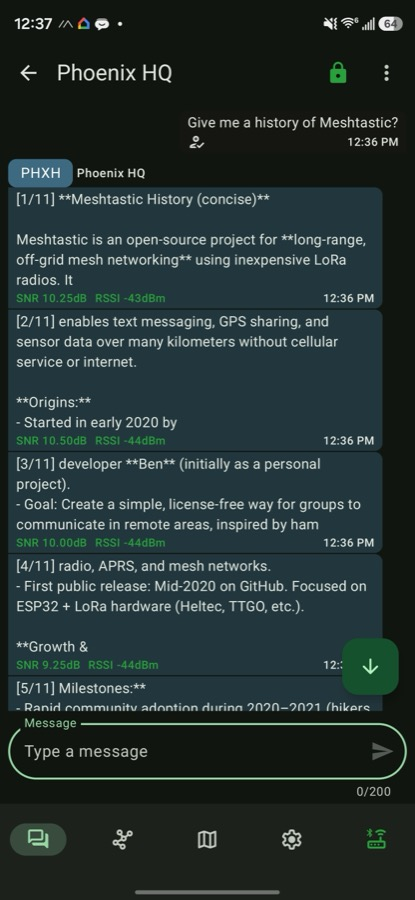

# Hermes Meshtastic Adapter

`hermes-meshtastic-adapter` is a Hermes Agent platform plugin that connects Hermes to a Meshtastic LoRa mesh. It receives plain-text messages from mesh nodes, forwards them into Hermes sessions, and sends replies back over LoRa as direct messages or channel broadcasts.

<p align="center">
  
  <br>
  <em>Talking to the Hermes agent over LoRa from the Meshtastic app: long replies are split into numbered chunks, each tagged with live signal quality.</em>
</p>

Public naming:

- GitHub repo: `hermes-meshtastic-adapter`
- Hermes plugin name: `meshtastic-platform`
- Hermes platform name: `meshtastic`

## What It Does

- Bridges Meshtastic text messages into Hermes Agent.
- Creates separate Hermes sessions for individual node DMs, such as `meshtastic:!da1b1613`.
- Creates shared Hermes sessions for channel broadcasts, such as `meshtastic:channel:0` or `meshtastic:channel:Primary`.
- Sends Hermes replies back to the source node or channel.
- Splits long replies into numbered LoRa-safe chunks.
- Exposes mesh tools for listing nodes, checking node info, reading signal quality, sending mesh messages, and querying telemetry.
- Stores telemetry, position, and signal history in SQLite.

## Supported Hardware

The adapter connects to a gateway node over USB serial or over TCP/IP.

- ESP32 USB-serial boards such as Heltec WiFi LoRa 32 V3 are supported and are the recommended gateway hardware.
- The gateway node should be wall-powered or USB-powered and configured as a stable base/client node.
- SenseCAP T1000-E and similar nRF52 tracker devices are BLE-first; their USB port is primarily for flashing and serial logs, not reliable control. They are not supported over USB serial by this plugin.
- BLE support is not included in v1.

Recommended gateway node settings:

- Role: `CLIENT` or `CLIENT_BASE`.
- Power: USB or wall power.
- Disable deep sleep and aggressive power saving on the gateway-connected node.
- Bluetooth may be disabled after initial Meshtastic app configuration.
- Region and modem preset must match your mesh.
- `LongFast` or your chosen preset must be configured consistently across nodes.

## Installation

Clone or download the plugin, then copy it into Hermes' plugin directory:

```bash
git clone https://github.com/amscotti/hermes-meshtastic-adapter
mkdir -p ~/.hermes/plugins/meshtastic
cp -R hermes-meshtastic-adapter/* ~/.hermes/plugins/meshtastic/
```

Install dependencies into the Hermes virtual environment:

```bash
~/.hermes/hermes-agent/venv/bin/python -m pip install -r ~/.hermes/plugins/meshtastic/requirements.txt
```

Enable the plugin:

```bash
hermes plugins enable meshtastic-platform
```

Restart the Hermes gateway after changing plugin files or environment variables.

## Configuration

Copy the bundled template and edit it for your node and mesh:

```bash
cp .env.example .env
```

Minimum `.env` example:

```env
MESHTASTIC_SERIAL_PORT=/dev/cu.usbserial-0001
MESHTASTIC_ALLOWED_NODES=!da1b1613
MESHTASTIC_HOME_CHANNEL=meshtastic:!da1b1613
MESHTASTIC_CHUNK_BYTES=170
MESHTASTIC_CHUNK_DELAY=4.0
MESHTASTIC_ACK_TIMEOUT=0
```

Environment variables:

| Variable | Required | Default | Description |
| --- | --- | --- | --- |
| `MESHTASTIC_SERIAL_PORT` | No* | `auto` | Serial path such as `/dev/cu.usbserial-0001`, or `auto` for discovery. *Configure either this or `MESHTASTIC_TCP_HOST`. |
| `MESHTASTIC_BAUD_RATE` | No | `115200` | Serial baud rate. |
| `MESHTASTIC_TCP_HOST` | No | None | Hostname or IP of a WiFi/Ethernet node. When set, the adapter connects over TCP instead of serial. |
| `MESHTASTIC_TCP_PORT` | No | `4403` | TCP API port of the Meshtastic node. |
| `MESHTASTIC_ALLOWED_NODES` | No | Empty | Preferred allowlist. Comma-separated node IDs that may talk to Hermes. |
| `MESHTASTIC_ALLOWED_USERS` | No | Empty | Legacy alias for `MESHTASTIC_ALLOWED_NODES`. |
| `MESHTASTIC_ALLOW_ALL_USERS` | No | `false` | If true, any mesh node may talk to Hermes. Use with caution. |
| `MESHTASTIC_HOME_CHANNEL` | No | Empty | Cron/default delivery target, such as `meshtastic:!da1b1613` or `meshtastic:channel:0`. |
| `MESHTASTIC_CHUNK_BYTES` | No | `170` | Max UTF-8 bytes per outbound LoRa chunk. `170` is conservative for multi-hop reliability and leaves headroom for encrypted-DM (PKI) overhead; the raw protocol ceiling is `237`. |
| `MESHTASTIC_CHUNK_DELAY` | No | `4.0` | Delay in seconds between chunk sends. |
| `MESHTASTIC_ACK_TIMEOUT` | No | `0` | Seconds to wait for ACK/NACK per outbound chunk. `0` is non-blocking. Set `30` to fail sends on NAK or timeout. |
| `MESHTASTIC_SEND_RETRIES` | No | `0` | Extra delivery attempts for un-ACKed **direct-message** chunks. `> 0` implies waiting for the ACK; transient failures (timeout, no-route) are re-sent, permanent ones (e.g. `TOO_LARGE`) are not. Broadcasts are never retried. |
| `MESHTASTIC_RETRY_BACKOFF` | No | `5.0` | Seconds to wait between delivery retries. |

## Connecting Over IP (TCP)

WiFi- or Ethernet-capable nodes expose a TCP API (default port `4403`). Set `MESHTASTIC_TCP_HOST` to connect over the network instead of USB serial:

```env
MESHTASTIC_TCP_HOST=192.168.1.50
MESHTASTIC_TCP_PORT=4403
```

When `MESHTASTIC_TCP_HOST` is set it takes precedence and serial discovery is skipped — the adapter uses a single transport at a time. Enable WiFi/Ethernet and the network API on the node through the Meshtastic app first. Reconnect with exponential backoff and the outbound queue work the same as over serial.

## Chat IDs

Direct messages use node-scoped chat IDs:

```text
meshtastic:!da1b1613
```

Channel messages use group-scoped chat IDs:

```text
meshtastic:channel:0
meshtastic:channel:Primary
```

## Tools

The plugin registers these Hermes tools:

- `mesh_list_nodes`: list visible nodes and signal status.
- `mesh_node_info`: inspect a node by ID or name.
- `mesh_signal_quality`: check current and recent SNR/RSSI.
- `mesh_send_dm`: send a direct message to a node.
- `mesh_send_broadcast`: send a channel broadcast.
- `mesh_telemetry`: read recent telemetry from a node.
- `mesh_telemetry_history`: query persisted telemetry, position, or signal history.

### Node Freshness

The meshtastic library only refreshes a node's `lastHeard` from periodic **NodeInfo** packets, so it lags a node's actual transmissions. The adapter therefore tracks a live overlay from the packet stream: on every received packet it updates the sender's `last_heard` (from the packet's `rxTime`) and, for direct (0-hop) packets, its `snr`/`rssi` — mirroring the official Meshtastic client. This is done for **every** heard node (including ones not on the allowlist, so you can watch a node you don't bridge), and `mesh_list_nodes` / `mesh_node_info` / `mesh_signal_quality` report the freshest of the library value and this overlay. `mesh_node_info` also returns `last_heard` / `last_heard_epoch`.

## Delivery Semantics

Meshtastic and LoRa delivery are best-effort.

- The adapter requests ACKs with `wantAck=True` for outbound packets.
- The adapter registers an `onAckNak` callback and records/logs ACK/NACK responses by packet ID when Meshtastic surfaces them.
- By default, sends are non-blocking: `sendText()` returning success means the local radio accepted the packet, and later ACK/NACK callbacks are logged if they arrive.
- Set `MESHTASTIC_ACK_TIMEOUT=30` or pass send metadata `meshtastic_ack_timeout` to wait for ACK/NACK per chunk. In this mode, NAKs and timeouts make `SendResult.success` false.
- ACK results are exposed in `SendResult.raw_response["chunks"][i]["ack"]` for waited sends, and can be inspected later in code with `adapter.get_ack_status(packet_id)`.
- Set `MESHTASTIC_SEND_RETRIES=3` to automatically re-send un-ACKed **direct-message** chunks. A retry only fires on a transient failure (ACK timeout, no-route, max-retransmit); permanent NAKs (`TOO_LARGE`, `NO_CHANNEL`, auth/PKI errors) are not retried, and broadcasts are never retried (no per-recipient ACK). Each retry waits `MESHTASTIC_RETRY_BACKOFF` seconds; the per-chunk attempt count is exposed in `SendResult.raw_response["chunks"][i]["attempts"]`. Note: if a message was actually delivered but its ACK was lost, a retry sends a duplicate.
- Long responses are split and paced, but any chunk may still be dropped by the mesh.

Even with ACK waiting enabled, delivery is still best-effort because ACK behavior depends on route quality, node firmware behavior, and whether the destination is awake.

## Cron Delivery

Set `MESHTASTIC_HOME_CHANNEL` to let Hermes cron jobs deliver output over Meshtastic.

Examples:

```env
MESHTASTIC_HOME_CHANNEL=meshtastic:!da1b1613
MESHTASTIC_HOME_CHANNEL=meshtastic:channel:0
```

The standalone cron sender creates a short-lived adapter connection when needed and disables queueing so cron failures are visible. A future improvement should prefer reusing the already-connected gateway adapter when available.

## Power And Sleep

The plugin does not modify Meshtastic power settings or force remote nodes to stay awake.

What it does:

- Maintains an open USB serial connection to the gateway node.
- Runs reconnect checks.
- Drains queued outbound messages after reconnect.

What it does not do:

- Disable light sleep or deep sleep.
- Change Meshtastic power config.
- Send radio keepalive packets.
- Prevent battery-powered nodes from sleeping.

For a gateway/base station, configure power behavior on the node itself through Meshtastic settings.

## Safety Notes

- Do not enable `MESHTASTIC_ALLOW_ALL_USERS=true` unless you understand the risk.
- Prefer node allowlists and DMs.
- Broadcast sending can consume shared mesh airtime quickly.
- Long AI responses may be impolite on public or busy meshes.
- Mesh messages may be overheard depending on channel configuration and key sharing.
- Do not expose channel keys or private keys to Hermes prompts, logs, or tools.

## Troubleshooting

### Plugin Uses Mock Serial Connection

This usually means the Hermes Python environment is missing dependencies or no serial port was discovered.

Install dependencies into the Hermes venv:

```bash
~/.hermes/hermes-agent/venv/bin/python -m pip install -r ~/.hermes/plugins/meshtastic/requirements.txt
```

Then set `MESHTASTIC_SERIAL_PORT` explicitly instead of `auto`.

### Serial Port Not Found

- macOS ports often look like `/dev/cu.usbserial-*` or `/dev/cu.usbmodem*`.
- Linux ports often look like `/dev/ttyUSB*` or `/dev/ttyACM*`.
- Install CP210X or CH34X drivers if your board requires them.
- Make sure no other Meshtastic client is holding the serial port.

### Direct Messages Fail Silently

The target node may not have initialized public key metadata. Pair the node with the official Meshtastic mobile app at least once, then let node info propagate through the mesh.

### Long Replies Are Missing Chunks

- Set `MESHTASTIC_CHUNK_BYTES=170`.
- Increase `MESHTASTIC_CHUNK_DELAY` to `5.0` or higher.
- Prefer shorter prompts and replies on weak or multi-hop meshes.

### Battery Nodes Miss Messages

Sleeping or power-saving nodes may not receive messages immediately. Configure device-side power behavior in Meshtastic.

## Development

Install runtime and development tools into the Hermes virtual environment:

```bash
~/.hermes/hermes-agent/venv/bin/python -m pip install -r requirements.txt -r requirements-dev.txt
```

Run tests using the Hermes virtual environment:

```bash
~/.hermes/hermes-agent/venv/bin/python -m unittest test_meshtastic.py
```

The tests use a mock Meshtastic serial interface and a temporary SQLite database.

Run formatting, linting, and type checks:

```bash
~/.hermes/hermes-agent/venv/bin/python -m ruff format .
~/.hermes/hermes-agent/venv/bin/python -m ruff check .
~/.hermes/hermes-agent/venv/bin/python -m pyrefly check --python-interpreter-path ~/.hermes/hermes-agent/venv/bin/python --search-path ~/.hermes/hermes-agent
```

Pull requests are checked by GitHub Actions for Ruff formatting, Ruff linting, Pyrefly type checking, and unit tests.

## Known Limitations

- USB serial and TCP/IP transports are supported; BLE is not implemented.
- Serial and TCP cannot be used at the same time; setting `MESHTASTIC_TCP_HOST` selects TCP.
- ACK/NACK waiting is optional via `MESHTASTIC_ACK_TIMEOUT`; default sends are non-blocking and log later ACK/NACK callbacks when they arrive.
- Delivery retry (`MESHTASTIC_SEND_RETRIES`) is opt-in and DM-only; a lost ACK on an already-delivered message causes a duplicate.
- Cron delivery uses a short-lived serial connection rather than the live gateway adapter.
- The outbound queue is in-memory only (bounded at 100, oldest-first eviction); messages queued during a disconnect are lost if the gateway restarts before the queue drains.
- The plugin does not manage node sleep or power settings.
- Broadcast tools should be used sparingly to avoid wasting shared airtime.
